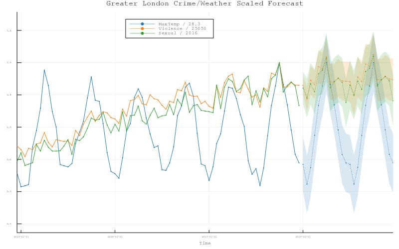

# Forecast 

Julia package containing utilities intended for Time Series analysis.

> :warning: This package is in an early development stage and its functionality has not been thoroughly tested. Please, consider to report issues if you find any.
> 
> :warning: This package is undergoing heavy refactoring and is in a feature freeze status.

## Featured Methods

* Autocorrelated models for univariate and multivariate data (ar)
* Autocorrelated model simulations for univariate and multivariate data (arsim)
* Autocorrelated model forecasting with custom plots (forecast)
* Autocorrelation & Autocovariance function and custom plots (acf)
* Boxcox Transformations and Inverse Boxcox Transformations (boxcox, iboxcox)
* Crosscorrelation & Crosscovariance function and custom plots (ccf)
* Henderson Moving Average Filter (hma)
* Lagged differences and Reverse lagged differences of a given order (d | p)
* Locally Estimated Scatterplot Smoothing (loess)
* Seasonal and Trend decomposition based on Loess and custom plot (stl) 
* Seasonal Plot for series and Time Series (splot)
* Simple Moving Average (sma)

## Datasets

* Atmospheric Carbon Dioxide Dry Air Mole Fractions from quasi-continuous measurements at Mauna Loa, Hawaii.

K.W. Thoning, A.M. Crotwell, and J.W. Mund (2020), Atmospheric Carbon Dioxide Dry Air Mole Fractions from continuous measurements at Mauna Loa, Hawaii, Barrow, Alaska, American Samoa and South Pole. 1973-2019, Version 2020-08 National Oceanic and Atmospheric Administration (NOAA), Global Monitoring Laboratory (GML), Boulder, Colorado, USA [DOI](https://doi.org/10.15138/yaf1-bk21)

FTP path: `ftp://aftp.cmdl.noaa.gov/data/greenhouse_gases/co2/in-situ/surface/`

* Airline Passengers

The classic Box & Jenkins airline data. Monthly totals of international airline passengers from 1949 to 1960. Box, G. E. P., Jenkins, G. M. and Reinsel, G. C. (1976) _Time Series Analysis, Forecasting and Control._ Third Edition. Holden-Day. Series G.

* London Crime and Weather

Ten years of monthly data about weather and crime in Greater London from 2008 to 2018. Data has been collected and joined from [London Assembly](london.gov.uk) and [Met Office](metoffice.gov.uk) (Heathrow Station).

* Estimates of world seaborne trade from AIS data collected by MarineTraffic; available at UN COMTRADE Monitor.

Cerdeiro, Komaromi, Liu and Saeed (2020). Subset with imports and exports data for France, Germany and the United Kingdom from 2015-04-01 to 2021-05-02. [UN Comtrade Database](https://comtrade.un.org/data/ais)

* Large Earthquakes

Number of earthquakes per year on earth with a magnitude higher or equal to six from 1950 to 2020.The data has been collected from the [U.S. Geological Survey
](https://earthquake.usgs.gov/) and aggregated.

## References

* [Cleveland et al. 1990]  Cleveland,  R.  B.;  Cleveland,  W.  S.;McRae, J. E.; and Terpenning, I.  1990.  STL: A seasonal-trend decomposition procedure based on loess. Journal of Official Statistics 6(1):3–73.
* Henderson, R. (1916). Note on graduation by adjusted average. Transactions of the Actuarial Society of America, 17:43-48. [Australian Bureau of Statistics: What Are Henderson Moving Averages?](https://www.abs.gov.au/websitedbs/d3310114.nsf/4a256353001af3ed4b2562bb00121564/5fc845406def2c3dca256ce100188f8e!OpenDocument#:~:text=WHAT%20ARE%20HENDERSON%20MOVING%20AVERAGES%3F)

